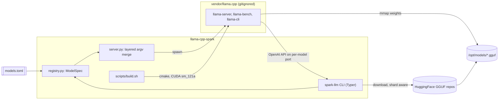

# spark-llm — llama.cpp on DGX Spark

Native **llama.cpp** CUDA build and OpenAI-compatible serving for the NVIDIA **DGX Spark** (GB10 / sm_121), wrapped in a small **uv**-managed Python CLI. Models are data (`models.toml`), not code — add a GGUF by editing TOML or passing `--hf` / `--model-path`.

## Architecture



## Requirements

Verified on this machine’s DGX Spark:

| Item | Value |
| --- | --- |
| GPU | NVIDIA GB10 (compute capability 12.1 / sm_121) |
| Memory | 121 GB unified |
| CUDA | 13.0 toolkit + driver 580.x |
| CPU / OS | aarch64, Ubuntu |
| Tooling | uv, Python 3.12, cmake ≥ 3.30 (via `uv tool`), ninja |

Host cmake 3.28 is too old for the `121a` architecture suffix — install a current cmake with `uv tool install 'cmake>=3.30'` and `uv tool install ninja` (already done if you followed the project setup).

## Quickstart

```bash
cd ~/projects/llama-cpp-spark

# 1. Build llama.cpp (CUDA, sm_121a-real)
make build
# or: uv run spark-llm build

# 2. Download gpt-oss-20b (~12 GB MXFP4 GGUF) into /opt/models
uv run spark-llm download gpt-oss-20b

# 3. Serve (background; health-checked)
uv run spark-llm serve gpt-oss-20b

# 4. Chat
curl http://127.0.0.1:8080/v1/chat/completions \
  -H 'Content-Type: application/json' \
  -d '{"model":"gpt-oss-20b","messages":[{"role":"user","content":"Say hello in one sentence."}]}'

uv run spark-llm chat gpt-oss-20b -m "Say hello in one sentence."

# 5. Stop
uv run spark-llm stop
```

Sanity checks: `uv run spark-llm doctor`, `uv run spark-llm models`.

## Adding a model

Edit [`models.toml`](models.toml). No Python changes required.

**Chat model (file + repo):**

```toml
[models.my-chat]
repo = "org/Some-Model-GGUF"
file = "some-model-Q4_K_M.gguf"
kind = "chat"
ctx_size = 32768
port = 8084
extra_args = ["--jinja"]
```

**Chat model (quant via llama.cpp `-hf`):**

```toml
[models.qwen3-8b]
repo = "unsloth/Qwen3-8B-GGUF"
quant = "Q4_K_M"
kind = "chat"
ctx_size = 32768
port = 8081
extra_args = ["--jinja"]
sampling = { temp = 0.6, top_p = 0.95, top_k = 20, min_p = 0.0 }
```

**Embedding model:**

```toml
[models.qwen3-embedding-4b]
repo = "Qwen/Qwen3-Embedding-4B-GGUF"
file = "Qwen3-Embedding-4B-Q4_K_M.gguf"
kind = "embedding"
port = 8090
extra_args = ["--embeddings"]
```

**Sharded or large GGUF (override layers / context as needed):**

```toml
[models.gpt-oss-120b]
repo = "ggml-org/gpt-oss-120b-GGUF"
file = "gpt-oss-120b-MXFP4.gguf"
kind = "chat"
ctx_size = 65536
n_gpu_layers = 70
port = 8082
extra_args = ["--jinja"]
```

(If a repo publishes multi-part `*-00001-of-00003.gguf` shards, point `file` at the first shard; llama.cpp loads siblings automatically. Download helpers match shard siblings by basename.)

Argv is merged in layers: **defaults ← kind flags ← per-model overrides ← CLI flags**.

### Escape hatches (no registry entry needed)

```bash
# Any Hugging Face GGUF repo (downloaded via huggingface_hub, then served with `-m`)
uv run spark-llm serve --hf TheBloke/TinyLlama-1.1B-Chat-v1.0-GGUF:Q4_K_M --port 8099

# Local file already on disk
uv run spark-llm serve --model-path /opt/models/mistral-7b-instruct.Q4_K_M.gguf --port 8083

# Pass unknown llama-server flags through
uv run spark-llm serve gpt-oss-20b -- --verbose --metrics
```

## Why `121a-real`

gpt-oss models use **MXFP4**. Native block-scale MXFP4 CUDA kernels only compile for Blackwell’s **`sm_121a`** target. Building with plain `121` often fails at `ptxas` with:

`Feature '.block_scale' not supported on .target 'sm_121'`

[`scripts/build.sh`](scripts/build.sh) therefore configures:

```bash
-DCMAKE_CUDA_ARCHITECTURES=121a-real
```

If that still fails, it retries with `-DCMAKE_CUDA_ARCHITECTURES=121 -DGGML_NATIVE=OFF` (works, but loses some prompt-processing speed). Do not “simplify” the primary arch back to `121` without knowing this.

Runtime also needs Blackwell compat libs on `LD_LIBRARY_PATH` (handled by `scripts/env.sh` / the CLI):

`/usr/local/cuda-13/compat` (or `/usr/local/cuda/compat`).

## Benchmarking and model comparison

Three different questions hide behind "which model is faster/better"; the CLI keeps them apart.

| Command | Measures | Does **not** measure |
| --- | --- | --- |
| `spark-llm bench A B` | Raw pp/tg tokens per second via `llama-bench`, using the exact served batch/ubatch/ngl/flash-attn/KV settings. Saved to `state/bench/*.json` with build provenance. | Task quality, chat template, serving latency under load. |
| `spark-llm eval sec …` | Accuracy on real 10-K/10-Q filings (XBRL ground truth), plus TTFT / prefill / decode by input length, cold vs warm prefix cache, and throughput under concurrency. | Anything outside filings. |
| `spark-llm eval swe …` | Coding ability through the served endpoint in three tiers: HumanEval+/MBPP+ (evalplus), Aider polyglot (edit-format compliance), a fixed 50-instance SWE-bench Verified subset (mini-swe-agent + swebench harness). Records tool-call/format failure rates. | Full SWE-bench. |

Every eval run is written to `state/evals/<suite>/<model>/<timestamp>-<task>/` as `run.json`
(model, GGUF, llama.cpp commit, CUDA arch actually built, server `/props`, decoding settings,
config hash) plus `results.jsonl`. `spark-llm eval report --suite sec|swe` tabulates the
latest finished run per model and warns when runs used different configs.

Rules the harness enforces so numbers stay comparable:

- **Bench refuses to run while a tracked server or foreign GPU process is alive** (`--force` to override).
- **Quality tasks decode at temperature 0 with a fixed seed**; per-model sampling from `models.toml` is only used for serving/perf.
- **The CUDA arch that actually built is recorded** (`build/spark-arch.txt`); a `121 + GGML_NATIVE=OFF` fallback build is flagged in reports rather than silently compared to `121a-real`.

### SEC suite

```bash
export SPARK_LLM_EDGAR_USER_AGENT="spark-llm you@example.com"   # EDGAR fair-access requirement
uv run spark-llm eval sec fetch                                  # 12 companies × (1×10-K + 3×10-Q) + XBRL facts
uv run spark-llm serve gpt-oss-20b
uv run spark-llm eval sec run gpt-oss-20b --task extract-full    # whole filing in context
uv run spark-llm eval sec run gpt-oss-20b --task extract-chunked # BM25 top-k chunks (works for 8k-ctx models)
uv run spark-llm eval sec run gpt-oss-20b --task qa-financebench # needs the judge model served too
uv run spark-llm eval sec perf gpt-oss-20b                       # 8k/32k/64k/100k tokens, cold vs warm, concurrency 1,4
uv run spark-llm eval report --suite sec
```

Ground truth for `extract-*` comes from EDGAR's XBRL company facts (revenue, net income, EPS,
assets, cash flow, …), matched with 0.5 % tolerance; answers that are right except for a
thousands/millions scale error are counted separately (`off_by_scale`). Filings that do not
fit the served context are skipped with the reason recorded, so an 8k-ctx model shows up as
"chunked only" instead of failing silently. Companies, tags, chunk size and tolerances live in
[`evals.toml`](evals.toml); prompts live in `evals/prompts/`.

#### Compare with an OpenAI frontier model

The OpenAI path reuses the exact fetched filings, prompts, numeric ground truth, tolerance,
and report format. The API key is read only from the environment and is never written to a
run artifact. Replace the model ID and context limit with values supported by your account:

```bash
export OPENAI_API_KEY="..."

# Cheap smoke test first: one extraction question.
uv run spark-llm eval sec run <OPENAI_MODEL> \
  --provider openai --context-window 128000 \
  --task extract-full --forms 10-K --limit 1

# Full pinned 10-K set.
uv run spark-llm eval sec run <OPENAI_MODEL> \
  --provider openai --context-window 128000 \
  --task extract-full --forms 10-K

# Shows the latest local and OpenAI runs together.
uv run spark-llm eval report --suite sec
```

`SPARK_LLM_OPENAI_CONTEXT_WINDOW` changes the default context budget, and `OPENAI_BASE_URL`
overrides `https://api.openai.com/v1`. OpenAI runs are named `openai:<model>` in reports.
They record score, skips, TTFT, end-to-end latency, input/output token usage, cached input
tokens, and reasoning tokens when the API returns them. External latency includes network
and provider queueing; local llama.cpp prompt throughput and remote API throughput are not
hardware-equivalent measurements. Context budgeting uses each model's own tokenizer, so
token counts—and therefore the set of oversized filings skipped—can differ; compare scores
alongside `n` and `skipped`. Frontier reasoning models do not consistently support
fixed temperature or seed, so the OpenAI path records and uses provider decoding defaults.
Use `--limit 1` before a full run to validate model access, context size, and likely cost.

Filing work needs context: a 10-K is roughly 50k–150k tokens. Raise `ctx_size` in
`models.toml` (and consider `cache_type_k`/`cache_type_v = "q8_0"`, `n_parallel`) for the
models you want on the full-document path. llama-server splits `--ctx-size` across
`--parallel` slots.

### SWE suite

```bash
uv run spark-llm eval swe check gpt-oss-20b              # tool-call smoke test through --jinja; run first
uv run spark-llm eval swe run gpt-oss-20b --tier 1       # evalplus humaneval+mbpp (minutes)
uv run spark-llm eval swe run gpt-oss-20b --tier 2       # aider polyglot (Docker, ~1 h)
uv run spark-llm eval swe run gpt-oss-20b --tier 3       # SWE-bench Verified ×50 (Docker, hours)
uv run spark-llm eval swe run gpt-oss-20b --tier 3 --dry-run   # print the harness commands only
uv run spark-llm eval report --suite swe
```

External harnesses run via `uvx` with the versions pinned in `evals.toml` and are never
vendored. Tiers 2 and 3 need Docker; the SWE-bench scoring images are x86_64-first, so the
intended layout is: Spark serves the model, an x86 box runs `spark-llm eval swe … --host <spark>`
(or `SPARK_LLM_EVAL_HOST`). The Tier 3 instance list is a seeded sample committed in
`evals.toml` so every model sees the same 50 tasks. Tier 2/3 command lines were written from
the harnesses' documented interfaces but have not been executed on this dev box (no Docker);
run `--dry-run` and check them against the pinned versions before a long run.

## Running several models at once

Each registry entry has its own `port`. Unified memory on the Spark can hold a chat model and an embedding model together:

```bash
uv run spark-llm serve gpt-oss-20b qwen3-embedding-4b
uv run spark-llm stop          # all tracked
uv run spark-llm stop gpt-oss-20b
```

PIDs and logs live under `state/`.

## Troubleshooting

| Symptom | Cause | Fix |
| --- | --- | --- |
| `cmake` / CUDA not found | Toolkit not on PATH or old cmake | `export PATH=/usr/local/cuda/bin:$HOME/.local/bin:$PATH`; `uv tool install 'cmake>=3.30'` |
| Build errors about GPU arch / `block_scale` | Wrong `CMAKE_CUDA_ARCHITECTURES` | Use `121a-real`; allow build.sh fallback |
| CUDA OOM on start | Context or model too large | Lower `--ctx-size`, reduce `--n-gpu-layers`, or pick a smaller quant |
| High latency | Layers on CPU | Ensure `--n-gpu-layers` is high enough; watch `nvidia-smi` during a request |
| `curl: (7) Failed to connect` | Server not up / wrong port | Wait for health; `spark-llm doctor`; check `state/<name>.log` |
| GGUF download stalls | Network / HF | Re-run `spark-llm download …` (resumable) |

## Project layout

```
llama-cpp-spark/
  models.toml          # model registry (edit this to add models)
  evals.toml           # eval suites: SEC companies/tags, SWE tiers (data, not code)
  evals/prompts/       # prompt templates used by the evals
  LLAMA_CPP_VERSION    # pinned llama.cpp commit
  scripts/build.sh     # CUDA native build
  scripts/env.sh       # LD_LIBRARY_PATH for GB10
  src/spark_llm/       # CLI + argv merge + download + bench
  src/spark_llm/evals/ # endpoint client, run records, SEC + SWE suites, report
  state/bench, state/evals  # persisted results (gitignored)
  tests/               # no-GPU unit tests
  vendor/llama.cpp/    # gitignored clone + build tree
```

## License

Project glue code: use freely. llama.cpp and model weights retain their upstream licenses.
