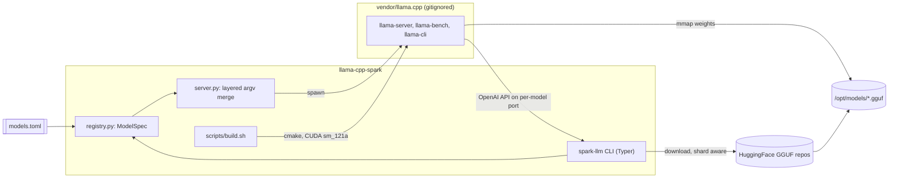

# spark-llm — llama.cpp on DGX Spark

Native **llama.cpp** CUDA build and OpenAI-compatible serving for the NVIDIA **DGX Spark** (GB10 / sm_121), wrapped in a small **uv**-managed Python CLI. Models are data (`models.toml`), not code — add a GGUF by editing TOML or passing `--hf` / `--model-path`.

## Architecture



## Requirements

Verified on this machine’s DGX Spark:

| Item | Value |
| --- | --- |
| GPU | NVIDIA GB10 (compute capability 12.1 / sm_121) |
| Memory | 121 GB unified |
| CUDA | 13.0 toolkit + driver 580.x |
| CPU / OS | aarch64, Ubuntu |
| Tooling | uv, Python 3.12, cmake ≥ 3.30 (via `uv tool`), ninja |

Host cmake 3.28 is too old for the `121a` architecture suffix — install a current cmake with `uv tool install 'cmake>=3.30'` and `uv tool install ninja` (already done if you followed the project setup).

## Quickstart

```bash
cd ~/projects/llama-cpp-spark

# 1. Build llama.cpp (CUDA, sm_121a-real)
make build
# or: uv run spark-llm build

# 2. Download gpt-oss-20b (~12 GB MXFP4 GGUF) into /opt/models
uv run spark-llm download gpt-oss-20b

# 3. Serve (background; health-checked)
uv run spark-llm serve gpt-oss-20b

# 4. Chat
curl http://127.0.0.1:8080/v1/chat/completions \
  -H 'Content-Type: application/json' \
  -d '{"model":"gpt-oss-20b","messages":[{"role":"user","content":"Say hello in one sentence."}]}'

uv run spark-llm chat gpt-oss-20b -m "Say hello in one sentence."

# 5. Stop
uv run spark-llm stop
```

Sanity checks: `uv run spark-llm doctor`, `uv run spark-llm models`.

## Adding a model

Edit [`models.toml`](models.toml). No Python changes required.

**Chat model (file + repo):**

```toml
[models.my-chat]
repo = "org/Some-Model-GGUF"
file = "some-model-Q4_K_M.gguf"
kind = "chat"
ctx_size = 32768
port = 8084
extra_args = ["--jinja"]
```

**Chat model (quant via llama.cpp `-hf`):**

```toml
[models.qwen3-8b]
repo = "unsloth/Qwen3-8B-GGUF"
quant = "Q4_K_M"
kind = "chat"
ctx_size = 32768
port = 8081
extra_args = ["--jinja"]
sampling = { temp = 0.6, top_p = 0.95, top_k = 20, min_p = 0.0 }
```

**Embedding model:**

```toml
[models.qwen3-embedding-4b]
repo = "Qwen/Qwen3-Embedding-4B-GGUF"
file = "Qwen3-Embedding-4B-Q4_K_M.gguf"
kind = "embedding"
port = 8090
extra_args = ["--embeddings"]
```

**Sharded or large GGUF (override layers / context as needed):**

```toml
[models.gpt-oss-120b]
repo = "ggml-org/gpt-oss-120b-GGUF"
file = "gpt-oss-120b-MXFP4.gguf"
kind = "chat"
ctx_size = 65536
n_gpu_layers = 70
port = 8082
extra_args = ["--jinja"]
```

(If a repo publishes multi-part `*-00001-of-00003.gguf` shards, point `file` at the first shard; llama.cpp loads siblings automatically. Download helpers match shard siblings by basename.)

Argv is merged in layers: **defaults ← kind flags ← per-model overrides ← CLI flags**.

### Escape hatches (no registry entry needed)

```bash
# Any Hugging Face GGUF repo (downloaded via huggingface_hub, then served with `-m`)
uv run spark-llm serve --hf TheBloke/TinyLlama-1.1B-Chat-v1.0-GGUF:Q4_K_M --port 8099

# Local file already on disk
uv run spark-llm serve --model-path /opt/models/mistral-7b-instruct.Q4_K_M.gguf --port 8083

# Pass unknown llama-server flags through
uv run spark-llm serve gpt-oss-20b -- --verbose --metrics
```

## Why `121a-real`

gpt-oss models use **MXFP4**. Native block-scale MXFP4 CUDA kernels only compile for Blackwell’s **`sm_121a`** target. Building with plain `121` often fails at `ptxas` with:

`Feature '.block_scale' not supported on .target 'sm_121'`

[`scripts/build.sh`](scripts/build.sh) therefore configures:

```bash
-DCMAKE_CUDA_ARCHITECTURES=121a-real
```

If that still fails, it retries with `-DCMAKE_CUDA_ARCHITECTURES=121 -DGGML_NATIVE=OFF` (works, but loses some prompt-processing speed). Do not “simplify” the primary arch back to `121` without knowing this.

Runtime also needs Blackwell compat libs on `LD_LIBRARY_PATH` (handled by `scripts/env.sh` / the CLI):

`/usr/local/cuda-13/compat` (or `/usr/local/cuda/compat`).

## Running several models at once

Each registry entry has its own `port`. Unified memory on the Spark can hold a chat model and an embedding model together:

```bash
uv run spark-llm serve gpt-oss-20b qwen3-embedding-4b
uv run spark-llm stop          # all tracked
uv run spark-llm stop gpt-oss-20b
```

PIDs and logs live under `state/`.

## Troubleshooting

| Symptom | Cause | Fix |
| --- | --- | --- |
| `cmake` / CUDA not found | Toolkit not on PATH or old cmake | `export PATH=/usr/local/cuda/bin:$HOME/.local/bin:$PATH`; `uv tool install 'cmake>=3.30'` |
| Build errors about GPU arch / `block_scale` | Wrong `CMAKE_CUDA_ARCHITECTURES` | Use `121a-real`; allow build.sh fallback |
| CUDA OOM on start | Context or model too large | Lower `--ctx-size`, reduce `--n-gpu-layers`, or pick a smaller quant |
| High latency | Layers on CPU | Ensure `--n-gpu-layers` is high enough; watch `nvidia-smi` during a request |
| `curl: (7) Failed to connect` | Server not up / wrong port | Wait for health; `spark-llm doctor`; check `state/<name>.log` |
| GGUF download stalls | Network / HF | Re-run `spark-llm download …` (resumable) |

## Project layout

```
llama-cpp-spark/
  models.toml          # model registry (edit this to add models)
  LLAMA_CPP_VERSION    # pinned llama.cpp commit
  scripts/build.sh     # CUDA native build
  scripts/env.sh       # LD_LIBRARY_PATH for GB10
  src/spark_llm/       # CLI + argv merge + download
  tests/               # no-GPU unit tests
  vendor/llama.cpp/    # gitignored clone + build tree
```

## License

Project glue code: use freely. llama.cpp and model weights retain their upstream licenses.
