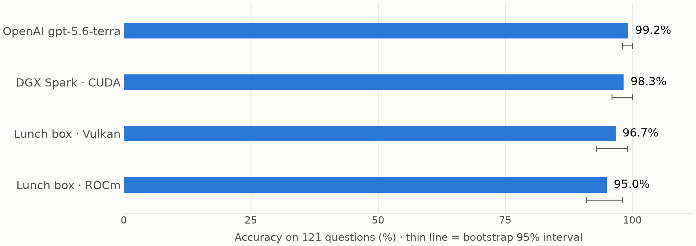
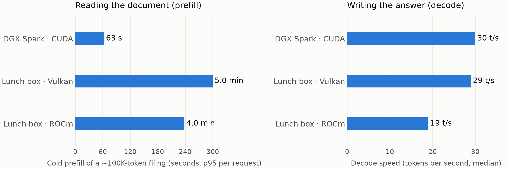

<!-- _class: lead -->
<!-- _paginate: false -->

# Local LLM inference for document work

## DGX Spark · AMD Strix Halo · hosted frontier

One workload, four stacks. September 2026 · Kaushik Ghosh

<!-- Cue: one experiment, one real task, four ways of running it. Everything in here traces to a committed run in the repo. -->

---

# Why local inference

- Frontier API cost scales per token
- Routine documents don't need frontier models
- Data stays in the building

Two runs of one benchmark suite on the hosted model: about $47 in API spend.

<!-- Cue: the goal is routing. Send routine, latency-tolerant document work to local hardware; keep API spend for what actually needs a frontier model. -->

---

# The workload

12 companies
latest 10-K each
11 financial metrics
**121 questions**

Ground truth: SEC XBRL facts
Tolerance: 0.5%
Filings: 45K–124K tokens

Revenue, net income, EPS, total assets, long-term debt, shares outstanding, … pulled from the filing text.

<!-- Cue: a real PE task, not a synthetic benchmark. Two filings (GS, STWD) exceed 131K tokens and are answered from their financial-statements section. -->

---

# The two machines

### NVIDIA DGX Spark
GB10 · 128 GB · Linux
llama.cpp built from source, CUDA

 

### AMD "lunch box" (Strix Halo)
Ryzen AI Max+ 395 · Radeon 8060S · 128 GB · Windows
Locked down → LM Studio (Vulkan, ROCm)

Same model file on both: gpt-oss-120b, MXFP4.

<!-- Cue: the lunch box has no Python and no compiler, so its runs went through LM Studio via a Node script. Same prompts, same sampling, same scoring. -->

---

# Prefill vs decode

### Prefill — reading the prompt
- Happens once per document
- Compute-bound
- Where the two boxes differ

### Decode — writing the answer
- Happens for every output token
- Memory-bandwidth-bound
- Nearly identical on both boxes

 

Prompt cache: pay prefill once per document; follow-up questions reuse it.

<!-- Cue: this one distinction explains every speed number that follows. -->

---

# Accuracy

Single run per stack. The intervals overlap: not distinguishable at this sample size.

<!-- Cue: on the 104 filings that fit in context, Terra, Spark and the lunch box on Vulkan all score 103/104. The gap is the two oversized filings. -->

---

# Results

| Stack | Accuracy (121) | Fits in ctx (104) | Decode | Cold prefill¹ | Whole run | Cost / run |
| --- | ---: | ---: | ---: | ---: | ---: | ---: |
| OpenAI gpt-5.6-terra | 99.2% | 103/104 | — | — | 20 min | ~$25 |
| DGX Spark · CUDA | 98.3% | 103/104 | 30 t/s | 40–60 s | 26 min | $0 |
| Lunch box · Vulkan | 96.7% | 103/104 | 29 t/s | 4–8 min | 77 min | $0 |
| Lunch box · ROCm | 95.0% | 101/104 | 19 t/s | 4–8 min | 72 min | $0 |
| DGX Spark · gpt-oss-20b | 87.6% | 90.4% | 45 t/s | 40–60 s | 19 min | $0 |

¹ first question on a new ~100K-token filing. Local: gpt-oss-120b MXFP4 unless noted; $0 = no per-token cost (hardware, power, time excluded). Hosted cost estimated from tokens at list price.

<!-- Cue: the 20b row is why the answer is 120b. ROCm on Windows was not the win Linux benchmarks suggest. -->

---

# Where the time goes

Same decode speed. Prefill is 4–5x slower on the lunch box, and it is the whole wall-clock gap.

<!-- Cue: once a document is cached, follow-up questions cost the same on both boxes. -->

---

# What it means

- **Background extraction** → go, on either box
- **User-facing flows** → design around cold prefill
  minutes on the lunch box · about a minute on the Spark
- **Cost** → ~$25 per suite run on the API vs $0 marginal locally

<!-- Cue: "$0 marginal" excludes power, the hardware and our time. The saving is real; it is not free. -->

---

# Caveats

- One run per stack; confidence intervals overlap
- Memorisation control not yet run
  public filings are in every model's training data
- Lunch box ran LM Studio's llama.cpp, not our pinned build
- Serial requests only; nothing measured under concurrency

<!-- Cue: say these before anyone else does. The control flag exists in the harness; it needs a run on the Spark. -->

---

# Next

- Run the no-document control
- Concurrency sweep on both boxes
- Linux + native llama-server on a lunch box
- A second use case

 

github.com/skiingfalcon/llama-cpp-spark → docs/index.md

<!-- Cue: the first two are a day of work; the third decides whether the lunch boxes are a serving option or only a PoC. -->
