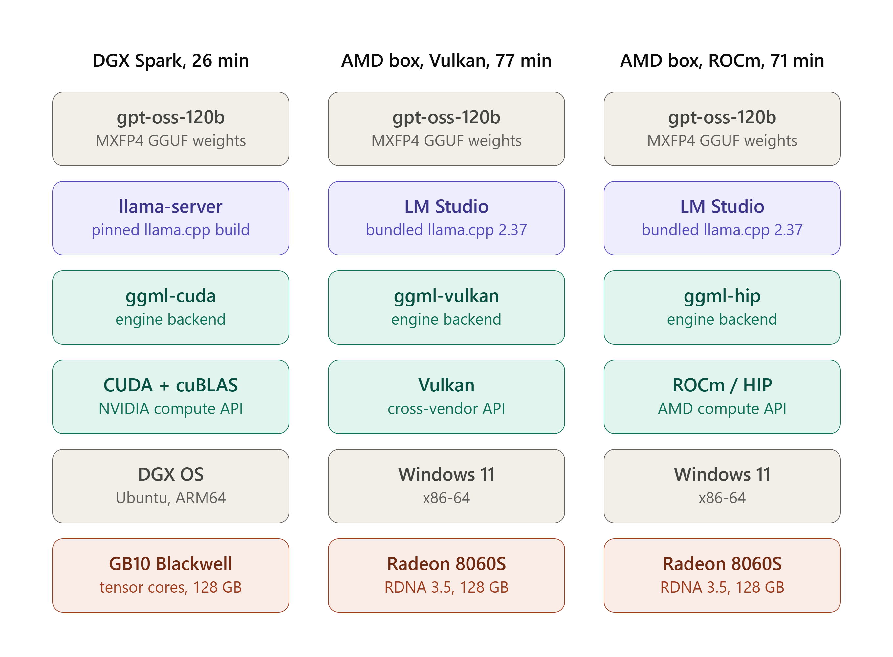

# SEC 10-K extraction — AMD Strix Halo vs NVIDIA DGX Spark vs hosted Terra (September 2026)

Same 121-question `extract-full` suite as the [Spark re-run](eval-report-2026-09-spark-cuda-rerun.md).
Local stacks run `gpt-oss-120b` MXFP4; the hosted column is OpenAI **`gpt-5.6-terra`**.
The AMD Strix Halo box was locked down (no Python / `uv` / compiler), so those numbers come
from [`scripts/lmstudio.mjs`](../scripts/lmstudio.mjs) against LM Studio instead of
`local-llm serve`.

| Stack | Model / engine | Score | Wall clock |
| --- | --- | ---: | ---: |
| **OpenAI hosted (gpt-5.6-terra)** | OpenAI API | **120/121 (99.2%)** | **20 min** |
| **NVIDIA DGX Spark (CUDA)** | gpt-oss-120b · llama-server | **119/121 (98.3%)** | **26 min** |
| **AMD Strix Halo (Vulkan)** | gpt-oss-120b · LM Studio 2.37 | **117/121 (96.7%)** | **77 min** |
| **AMD Strix Halo (ROCm)** | gpt-oss-120b · LM Studio 2.37 | **115/121 (95.0%)** | **72 min** |

Hosted Terra leads by one question. The three local gpt-oss-120b stacks sit within ~3 points
of each other; AMD wall clock is ~3× the NVIDIA Spark because cold ~100K-token prefills take
4–8 minutes each.



## Setup

| | OpenAI hosted (Terra) | NVIDIA DGX Spark (CUDA) | AMD Strix Halo (Vulkan) | AMD Strix Halo (ROCm) |
| --- | --- | --- | --- | --- |
| Model | `gpt-5.6-terra` | `gpt-oss-120b` MXFP4 | same | same |
| Hardware | OpenAI datacenter | GB10 Blackwell, 128 GB (≈121 GiB usable) | Radeon 8060S (RDNA 3.5), 128 GB UMA | same |
| OS / path | OpenAI API | DGX OS (Ubuntu, ARM64) | Windows 11 · LM Studio | same |
| Server | OpenAI | `llama-server` via `local-llm` | LM Studio local server | same |
| Backend | hosted | ggml-cuda / CUDA + cuBLAS | ggml-vulkan / Vulkan | ggml-hip / ROCm HIP |
| Runtime | provider | pinned `LLAMA_CPP_RELEASE` | LM Studio `…-vulkan-avx2` **2.37.0** | LM Studio `…-amd-rocm-avx2` **2.37.0** |
| Context | 1,050,000 | 131,072 | 131,072 | 131,072 |

**AMD LM Studio load settings** (both backends): GPU offload 36/36 layers (~65 GB),
evaluation/physical batch 512, unified KV cache on, KV cache offloaded to GPU, keep model
in memory. Auto-update of runtime packs was off for these runs.

**Task / decoding:** `extract-full`, 12 companies × latest 10-K, 11 XBRL tags, 0.5% relative
tolerance. Local stacks: temperature 0, seed 42, `max_tokens` 4096. Terra: provider defaults
with the same 4096 completion budget, `--parallel 1`. Halo runs used
`node scripts/lmstudio.mjs run --forms 10-K`.

**Artifacts** (all under `state/evals/sec/`; folder names encode stack for tracing):

| Stack | Folder |
| --- | --- |
| OpenAI hosted (Terra) | [`openai_gpt-5.6-terra/20260912T142344Z-extract-full/`](../state/evals/sec/openai_gpt-5.6-terra/20260912T142344Z-extract-full/) |
| NVIDIA DGX Spark (CUDA) · 120b | [`gpt-oss-120b-spark-cuda/20260912T132250Z-extract-full/`](../state/evals/sec/gpt-oss-120b-spark-cuda/20260912T132250Z-extract-full/) |
| NVIDIA DGX Spark (CUDA) · 20b | [`gpt-oss-20b-spark-cuda/20260912T135023Z-extract-full/`](../state/evals/sec/gpt-oss-20b-spark-cuda/20260912T135023Z-extract-full/) |
| AMD Strix Halo (Vulkan) · 120b | [`gpt-oss-120b-halo-vulkan/20260913T030643Z-extract-full/`](../state/evals/sec/gpt-oss-120b-halo-vulkan/20260913T030643Z-extract-full/) |
| AMD Strix Halo (ROCm) · 120b | [`gpt-oss-120b-halo-rocm/20260913T044559Z-extract-full/`](../state/evals/sec/gpt-oss-120b-halo-rocm/20260913T044559Z-extract-full/) |

## Results

### Accuracy by context mode

| Slice | n | OpenAI hosted (Terra) | NVIDIA DGX Spark (CUDA) | AMD Strix Halo (Vulkan) | AMD Strix Halo (ROCm) |
| --- | ---: | ---: | ---: | ---: | ---: |
| Full document (local no-fallback set) | 104 | 103/104 (99.0%) | 103/104 (99.0%) | 103/104 (99.0%) | 101/104 (97.1%) |
| GS/STWD via Item 8 (local) / whole (Terra) | 17 | **17/17 (100%)** | 16/17 (94.1%) | 14/17 (82.4%) | 14/17 (82.4%) |
| **All questions** | **121** | **120/121 (99.2%)** | **119/121 (98.3%)** | **117/121 (96.7%)** | **115/121 (95.0%)** |

On the 104 filings that fit in 131K, Terra, NVIDIA Spark, and AMD Vulkan all score 103/104.
Terra's remaining edge is reading GS/STWD whole (1.05M context) plus one different miss
elsewhere (HD shares).

### Per-tag and per-company accuracy (AMD columns)

The Spark and Terra per-tag / per-company tables live in the
[Spark re-run report](eval-report-2026-09-spark-cuda-rerun.md#per-tag-accuracy) and are not
repeated here; these are the AMD columns for the same 121 questions. Bold marks a miss.

| Tag | AMD Strix Halo (Vulkan) | AMD Strix Halo (ROCm) |
| --- | ---: | ---: |
| Assets | 12/12 | 12/12 |
| CashAndCashEquivalentsAtCarryingValue | 11/11 | 11/11 |
| CommonStockSharesOutstanding | **9/10** | **9/10** |
| EarningsPerShareDiluted | **11/12** | **11/12** |
| Liabilities | 11/11 | 11/11 |
| LongTermDebtNoncurrent | 9/9 | **8/9** |
| NetCashProvidedByUsedInOperatingActivities | 12/12 | 12/12 |
| NetIncomeLoss | **11/12** | **10/12** |
| OperatingIncomeLoss | 9/9 | 9/9 |
| Revenues | 11/11 | 11/11 |
| StockholdersEquity | **11/12** | **11/12** |

| Ticker | AMD Strix Halo (Vulkan) | AMD Strix Halo (ROCm) |
| --- | ---: | ---: |
| AAPL | 11/11 | 11/11 |
| CAT | 11/11 | 11/11 |
| GS | **6/8** | **6/8** |
| HD | 11/11 | 11/11 |
| INTU | 11/11 | 11/11 |
| MSFT | 11/11 | 11/11 |
| NEE | 11/11 | **10/11** |
| PG | 9/9 | **8/9** |
| PLTR | **9/10** | **9/10** |
| STWD | **8/9** | **8/9** |
| WMT | 9/9 | 9/9 |
| XOM | 10/10 | 10/10 |

### Every miss, itemized

**OpenAI hosted (Terra) — 1:**

- **HD `CommonStockSharesOutstanding`**: replied `unknown` despite the count on the 10-K
  cover page. All three local stacks got it.

**Shared by both AMD backends (3):**

- **GS `NetIncomeLoss`** (Item 8): answered 16.3B vs expected 17.176B. Close but outside 0.5%.
- **GS `EarningsPerShareDiluted`** (Item 8): AMD Vulkan replied `unknown`; AMD ROCm answered
  51.95 vs expected 51.32. NVIDIA Spark and Terra got both.
- **PLTR `CommonStockSharesOutstanding`** (full): answered 2,391,192 vs expected
  2,391,192,000 — classic `off_by_scale` (thousands in the table, not multiplied out). Both
  AMD backends; NVIDIA Spark and Terra got it.

**AMD Strix Halo (Vulkan) only (1):**

- **STWD `StockholdersEquity`** (Item 8): 7.125B vs expected 6.796B. AMD ROCm got this one.

**AMD Strix Halo (ROCm) only (3):**

- **PG `LongTermDebtNoncurrent`**: 29.3B vs expected 22.8B (which-line / total-debt pick).
- **NEE `StockholdersEquity`**: 66.5B vs expected 54.6B (likely including NCI or a broader
  equity total).
- **STWD `NetIncomeLoss`** (Item 8): 655M vs expected 412M.

**NVIDIA DGX Spark (CUDA) misses that both AMD backends (and Terra) got right:**

- **GS operating cash flow**: Spark answered +17.0B (parent-only condensed statement in the
  notes); AMD and Terra answered −45.154B (consolidated). Documented in the
  [re-run report](eval-report-2026-09-spark-cuda-rerun.md#every-remaining-miss-itemized).
- **CAT `LongTermDebtNoncurrent`**: Spark answered 50.7B (incl. Financial Products);
  AMD and Terra answered 30.7B (machinery-only, matching XBRL).

Same local weights and prompts, different llama.cpp build/backend — borderline which-line
items flip. Treat the ~2-point spread among local stacks as run-to-run / build-to-build
variance at the accuracy ceiling, **not** a GPU-vendor quality difference. Terra's one-miss
lead is real but narrow, and comes with API cost and data egress.

### Latency and throughput

| Metric | OpenAI hosted (Terra) | NVIDIA DGX Spark (CUDA) | AMD Strix Halo (Vulkan) | AMD Strix Halo (ROCm) |
| --- | ---: | ---: | ---: | ---: |
| Wall clock | 20 min | 26 min | 77 min | 72 min |
| Request-time sum | **~3.5 min** | 26 min | 77 min | 72 min |
| TTFT p50 | 1.44 s | 0.57 s | 1.38 s | 1.19 s |
| Total p50 / p95 | 1.6 s / 2.9 s | 5.8 s / 62.9 s | 5.1 s / 300 s | 7.4 s / 238 s |
| Cold prefill TTFT p50 | n/a (hosted) | ~40–60 s (suite p95) | **271 s** | **257 s** |
| Decode tok/s p50 | n/a | 30.3 | **28.8** | 19.4 |
| Prompt tokens (suite) | 12.39 M (0 cached) | 10.52 M (90% cached) | 9.98 M | 9.98 M |

- Terra's wall clock is ~6× its request time (`--parallel 1` + rate-limit backoff); estimated
  list-price cost ~$25/run with no cache discount observed.
- **Cold prefill dominates AMD wall clock.** The 12 first-of-filing requests take 2–8 minutes
  each (~90–115K tokens at ~300 tok/s).
- **AMD Vulkan decodes ~50% faster than AMD ROCm** (28.8 vs 19.4 tok/s); ROCm edges Vulkan
  on cold prefill. Net wall clock favors ROCm slightly; **accuracy and decode favor Vulkan**.
- Ignore AMD `run.json` `prompt_tps_p50` (58K / 69K) — inflated by cache-warm requests.

## Pros and cons

### OpenAI hosted (`gpt-5.6-terra`)

**Pros**

- Best score (99.2%); only stack that reads GS/STWD whole; fastest per-answer latency.

**Cons**

- ~$25/run, no cache economics observed, data egress, rate limits stretch wall clock, no
  fixed temperature/seed.

### NVIDIA DGX Spark (CUDA) + `local-llm`

**Pros**

- 98.3% with pinned llama.cpp, full harness telemetry, 90% prompt-cache reuse, no API spend.

**Cons**

- Needs Python / CUDA stack; 131K context forces Item 8 fallback on GS/STWD.

### AMD Strix Halo via LM Studio (`scripts/lmstudio.mjs`)

**Pros**

- **96–97% without Python** when only LM Studio is installable; AMD Vulkan slightly ahead of
  AMD ROCm on this suite.

**Cons**

- ~3× wall clock vs Spark; unpinned LM Studio runtime; no `/tokenize` / cache accounting.

## Caveats

1. **Vendor / path labels.** Tables always say **OpenAI hosted (Terra)**, **NVIDIA DGX Spark
   (CUDA)**, **AMD Strix Halo (Vulkan|ROCm)** — never bare backend names.
2. **Not an apples-to-apples engine bake-off** between Spark and Halo (pinned llama.cpp vs
   LM Studio 2.37.0). Terra is a different model entirely.
3. **Token accounting differs** across GGUF tokenizer, chars/4.6 estimates, and `o200k_base`.
4. Single run per AMD backend; the two AMD engines disagree on four items.
5. Artifact folders live under `state/evals/sec/` with stack-qualified names so raw
   `run.json` / `results.jsonl` stay next to the Spark and Terra runs.

## Reproduce

```powershell
# AMD Strix Halo (locked-down path)
$env:EDGAR_UA = "local-llm you@example.com"
# Load gpt-oss-120b in LM Studio: ctx 131072, GPU offload max, batch 512, KV on GPU
# Runtime → Vulkan or ROCm llama.cpp (Windows) v2.37.0; start local server

node scripts/lmstudio.mjs fetch
node scripts/lmstudio.mjs run --forms 10-K
# writes state/evals/sec/gpt-oss-120b-halo-{vulkan|rocm}/<timestamp>-extract-full/
node scripts/lmstudio.mjs report
```

Spark / Terra reproduction: [eval-report-2026-09-spark-cuda-rerun.md](eval-report-2026-09-spark-cuda-rerun.md).
Unlocked Halo: [Windows / AMD Strix Halo](../README.md#windows--amd-strix-halo).

## Bottom line for the team

- **Hosted Terra still wins narrowly (99.2%)** — one miss, whole-document GS/STWD, ~$25/run
  and data egress.
- **`gpt-oss-120b` on NVIDIA Spark is the on-prem recommendation (98.3%)** when you can run
  `local-llm`: pinned build, cache economics, no egress.
- **AMD Strix Halo + LM Studio is a credible locked-down fallback:** 96.7% (Vulkan) /
  95.0% (ROCm) on the same suite. Prefer **AMD Vulkan** (score + decode); do not treat
  multi-minute cold prefills as competitive with the Spark.
- Borderline which-line misses flip across local builds; do not over-read a 2-point gap as
  a GPU-vendor quality difference.
