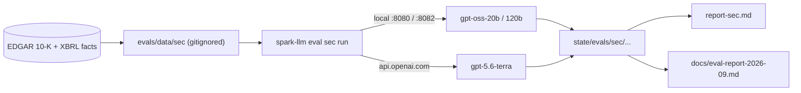

# SEC 10-K extraction eval — September 2026

> **Superseded:** these are the pre-fix raw numbers, kept for cross-checking. The post-fix
> re-run (max_tokens 4096, ground-truth alias fixes, per-filing fallback, no rate-limit
> losses) is in [eval-report-2026-09-rerun.md](eval-report-2026-09-rerun.md).

Comparison of three models on the same pinned SEC extraction workload, run on the
DGX Spark (GB10) and against the OpenAI API.

| Model | Where it ran | Context | Headline score† | Paired score (96 Qs) |
| --- | --- | ---: | ---: | ---: |
| `gpt-oss-20b` | Local Spark | 131,072 | 76.7% (79/103) | **77.1% (74/96)** |
| `gpt-oss-120b` | Local Spark | 131,072 | 90.3% (93/103) | **89.6% (86/96)** |
| `gpt-5.6-terra` | OpenAI API | 1,050,000 | 96.4% (106/110) | **95.8% (92/96)** |

† The raw `score` column in [`state/evals/report-sec.md`](../state/evals/report-sec.md)
covers **different question sets** per model (see [Why skip counts differ](#why-skip-counts-differ)).
Use the paired column for like-for-like comparison.



## Setup

- **Task:** `extract-full` — put the entire 10-K text in context and ask for one XBRL
  metric per question.
- **Corpus:** 12 companies (AAPL, MSFT, GS, XOM, PLTR, WMT, PG, CAT, NEE, HD, INTU, STWD),
  latest 1× 10-K each. Ground truth from EDGAR company facts; numeric match at 0.5% relative
  tolerance.
- **Tags (11):** Revenues, NetIncomeLoss, OperatingIncomeLoss, EarningsPerShareDiluted,
  NetCashProvidedByUsedInOperatingActivities, Assets, Liabilities, StockholdersEquity,
  CashAndCashEquivalentsAtCarryingValue, LongTermDebtNoncurrent, CommonStockSharesOutstanding.
- **Decoding:** local models used `temperature=0`, `seed=42`, `max_tokens=512`. Terra used
  provider defaults (frontier reasoning models reject fixed temperature/seed). **The 512
  budget turned out to be the main source of local misses; see [What changed](#what-changed-since-this-run).**
- **Hardware / build:** NVIDIA GB10, llama.cpp `82d6bb284d1f`, both local models at 131,072
  tokens per slot. Terra at the published 1.05M context window.
- **Artifacts:**
  - [`state/evals/sec/gpt-oss-20b/20260912T022410Z-extract-full/`](../state/evals/sec/gpt-oss-20b/20260912T022410Z-extract-full/)
  - [`state/evals/sec/gpt-oss-120b/20260912T030429Z-extract-full/`](../state/evals/sec/gpt-oss-120b/20260912T030429Z-extract-full/)
  - [`state/evals/sec/openai_gpt-5.6-terra/20260912T033135Z-extract-full/`](../state/evals/sec/openai_gpt-5.6-terra/20260912T033135Z-extract-full/)

## Results

### Paired accuracy (96 questions answered by all three)

| Model | Correct | Score |
| --- | ---: | ---: |
| `gpt-oss-20b` | 74 / 96 | 77.1% |
| `gpt-oss-120b` | 86 / 96 | 89.6% |
| `gpt-5.6-terra` | 92 / 96 | 95.8% |

### Per-tag accuracy (paired set)

| Tag | 20b | 120b | Terra |
| --- | ---: | ---: | ---: |
| Assets | 8/9 | 9/9 | 9/9 |
| CashAndCashEquivalentsAtCarryingValue | 9/9 | 9/9 | 9/9 |
| CommonStockSharesOutstanding | **2/8** | **4/8** | **8/8** |
| EarningsPerShareDiluted | 9/9 | 9/9 | 9/9 |
| Liabilities | 6/8 | 8/8 | 8/8 |
| LongTermDebtNoncurrent | 3/8 | 6/8 | 7/8 |
| NetCashProvidedByUsedInOperatingActivities | 7/8 | 7/8 | 8/8 |
| NetIncomeLoss | 9/10 | 10/10 | 10/10 |
| OperatingIncomeLoss | 8/8 | 8/8 | 8/8 |
| Revenues | 7/10 | 7/10 | 7/10 |
| StockholdersEquity | 6/9 | 9/9 | 9/9 |

`CommonStockSharesOutstanding` is the clearest capability gap. The 20b model also produced
2 `off_by_scale` answers (right digits, wrong thousands/millions); 120b and Terra had none.

`Revenues` is 7/10 for **all three**. That points at a harness/XBRL ambiguity
(`Revenues` vs `RevenueFromContractWithCustomer…`), not a model weakness.

### Per-company accuracy (paired set)

| Ticker | 20b | 120b | Terra |
| --- | ---: | ---: | ---: |
| AAPL | 8/11 | 10/11 | 11/11 |
| CAT | 9/10 | 9/10 | 10/10 |
| HD | 8/10 | 8/10 | 9/10 |
| INTU | 7/8 | 8/8 | 8/8 |
| MSFT | 10/11 | 10/11 | 11/11 |
| NEE | 4/9 | 8/9 | 8/9 |
| PG | 7/9 | 8/9 | 9/9 |
| PLTR | 7/10 | 9/10 | 10/10 |
| WMT | 7/9 | 8/9 | 8/9 |
| XOM | 7/9 | 8/9 | 8/9 |

### Latency, tokens, cost

| Model | Wall clock | Request time (sum) | TTFT p50 | Total p50 | Prompt tokens | Cached | Reasoning |
| --- | ---: | ---: | ---: | ---: | ---: | ---: | ---: |
| `gpt-oss-20b` | ~14 min | ~14 min | 3.7 s | 4.3 s | 8.79 M | — | — |
| `gpt-oss-120b` | ~22 min | ~22 min | 6.1 s | 6.5 s | 8.79 M | 7.96 M | 0 |
| `gpt-5.6-terra` | ~24 min | ~2.6 min | 1.2 s | 1.2 s | 11.07 M | 0.05 M | 1.4 k |

Terra's wall clock is dominated by HTTP 429 backoff, not inference. Estimated API cost for
the Terra run at GPT-5.6 Terra list prices ($2 / M fresh input, $0.20 / M cached input,
$12 / M output): **~$22**. Local runs have zero per-token cost once the Spark is paid for.

Local prefix caching is dramatically stronger: the 120b server reused ~90% of prompt tokens
across repeated questions on the same filing. Terra reused almost none.

## Why skip counts differ

| Model | Skipped | Reason |
| --- | ---: | --- |
| `gpt-oss-20b` | 17 | GS + STWD filings are **242,026 tokens**; over the 131,072 context budget |
| `gpt-oss-120b` | 17 | Same two filings, same budget |
| `gpt-5.6-terra` | 10 | **HTTP 429** rate limiting on CAT, HD, INTU, NEE, STWD — not a context limit |

Terra had the context to read GS and answered it. The local models could not. Conversely,
Terra is missing answers that both local models completed, purely because of rate limits.
That is why the paired 96-question set is the fair comparison, and why a Terra re-run with
`--parallel 1` (and perhaps a longer sleep between filings) would be worthwhile before
treating 96.4% as a final number.

## Pros and cons

### Local Spark (`gpt-oss-20b` / `gpt-oss-120b`)

**Pros**

- No per-token cost; predictable unit economics once the box is paid for.
- Data never leaves the building — important for confidential filings / PII.
- Strong llama.cpp prefix caching: later questions on the same 10-K are cheap and fast.
- Full control of decoding (temperature, seed), build, and CUDA arch.
- 120b closes most of the quality gap to Terra on this workload (89.6% vs 95.8% paired).

**Cons**

- Hard 131K context ceiling; GS / STWD (176K–242K tokens) are answered from Item 8 or
  retrieved chunks rather than the whole filing (recorded as `mode != full`).
- 120b weights alone are ~63 GB resident; KV cache and concurrency compete for the
  Spark's 121 GB unified memory.
- Slower TTFT than the API (3.7–6.1 s p50 vs 1.2 s).
- You own ops: process crashes, CUDA upgrades, model pins, auth in front of `0.0.0.0`.
- ~~`models.toml` still pins 120b at `ctx_size = 65536`~~ — now 131,072 by default.

### Hosted frontier (`gpt-5.6-terra`)

**Pros**

- Highest accuracy on the paired set (95.8%).
- 1.05M context — large filings that local OSS cannot hold.
- Fastest responses (1.2 s p50 TTFT / total).
- No local GPU / CUDA / llama.cpp maintenance.

**Cons**

- ~$22 per run of this suite (and more if you re-run for rate-limit recovery).
- Data leaves your network; subject to the provider's retention and residency terms.
- Rate limits (HTTP 429) silently reduce coverage unless you retry or throttle.
- No fixed temperature / seed on frontier reasoning models — harder to reproduce bit-exact.
- Weak prompt-cache reuse on this chat-completions path; repeated questions on one filing
  re-pay nearly the full input cost.

## Caveats

1. **Latency is not a hardware bake-off.** Terra numbers include network and provider
   queueing; local numbers are on-box. Treat them as user-experienced latency, not kernel
   throughput.
2. **Tokenizers differ.** Local budgets use the GGUF tokenizer; Terra uses tiktoken /
   `o200k_base`. Skip sets can diverge even at the same nominal context size.
3. **`Revenues` is ambiguous.** All three models miss the same three revenue questions —
   investigate the XBRL tag aliases before drawing model conclusions.
4. **Terra's run is rate-limit degraded.** 10 of 120 items never reached the model. A clean
   re-run would change both the headline score and the paired set.
5. **Config hashes differ by design.** Local runtime (ngl, flash-attn, batch) and Terra
   runtime (provider, context_window) will never match; the report warning is expected.

## Reproduce

```bash
cd ~/projects/llama-cpp-spark
export SPARK_LLM_EDGAR_USER_AGENT="spark-llm you@example.com"

# Corpus (once)
uv run spark-llm eval sec fetch

# Local 20b (auto-negotiates full context when ctx_size = 0)
uv run spark-llm serve gpt-oss-20b
uv run spark-llm eval sec run gpt-oss-20b --task extract-full --forms 10-K
uv run spark-llm stop gpt-oss-20b

# Local 120b (models.toml now defaults to 131072)
uv run spark-llm serve gpt-oss-120b
uv run spark-llm eval sec run gpt-oss-120b --task extract-full --forms 10-K
uv run spark-llm stop gpt-oss-120b

# Frontier (OPENAI_API_KEY from .env)
uv run spark-llm eval sec run gpt-5.6-terra \
  --provider openai \
  --task extract-full \
  --forms 10-K

# Table of latest finished runs
uv run spark-llm eval report --suite sec
```

## What changed since this run

A post-hoc audit of the three `results.jsonl` files showed the 120b-vs-Terra gap is mostly a
harness artefact, not a model gap. The harness was fixed on 2026-09-12; the tables above are
from the **pre-fix** runs and will be replaced after a re-run.

**Context was not the limiter.** All 96 paired questions had the full filing in context
(`doc_tokens == context_tokens`; the harness skips oversized filings rather than truncating
them). More context would only have added GS and STWD, and gpt-oss's native window is 131K.

**Output budget was.** gpt-oss reasons before answering and spends that budget from
`max_tokens`. At 512 tokens it frequently ran out mid-thought and emitted no answer
(`finish_reason=length`, empty content), which the old client recorded as a plain miss.

| Model | Paired misses | Hit 512 tokens, empty answer | Shared by all three | Genuine model errors |
| --- | ---: | ---: | ---: | ---: |
| `gpt-oss-20b` | 22 | 13 | 4 | 5 |
| `gpt-oss-120b` | 10 | 6 | 4 | 0 |
| `gpt-5.6-terra` | 4 | 0 | 4 | 0 |

Every non-shared 120b miss was a truncated reasoning trace; on every question it finished, it
was right. Terra answered in ~7 completion tokens (p50) with almost no reasoning and never hit
the wall.

**The four shared misses were ground-truth bugs**, verified against EDGAR company facts:

- WMT `Revenues`: expected the `Revenues` total (713.2B); models returned the
  contract-revenue net-sales line (706.4B), which is also in the filing.
- NEE `Revenues`: expected came from alias `RevenueFromContractWithCustomer…` (25.8B); NEE's
  top line is `RegulatedAndUnregulatedOperatingRevenue` (27.4B), which all models returned.
- HD `LongTermDebtNoncurrent`: the tag is absent for HD, so alias `LongTermDebt` (49.4B,
  *includes* current installments) became expected. Models returned
  `LongTermDebtAndCapitalLeaseObligations` (46.3B), the actual "excluding current portion" line.
- XOM `Revenues`: expected `Revenues` = "Total revenues and other income" (332.2B); models
  returned "Sales and other operating revenue" (323.9B), which XOM does not tag in us-gaap.
  The old label "total revenues (net sales)" invited that answer.

**Harness fixes (this commit):**

1. `[quality].max_tokens` 512 → 4096; optional `reasoning_effort` knob (`--reasoning-effort`,
   passed as `chat_template_kwargs` to llama-server or `reasoning_effort` to OpenAI).
2. The client now captures streamed `reasoning_content`, counts its tokens, and flags
   `truncated` items; `summarise` and the report carry a `truncated` column.
3. Ground truth: alias order is now a real preference; `Revenues` gained
   `RegulatedAndUnregulatedOperatingRevenue`; `LongTermDebt` was removed as an alias and
   `LongTermDebtAndCapitalLeaseObligations` added; both tags accept any same-period family
   value (`accept_aliases`), and each result records the XBRL `concept` and `matched_value`.
   `NetIncomeLoss` / `StockholdersEquity` stay strict (their labels say "attributable").
   The `Revenues` label now points at the income statement's total-revenues line.
4. `eval report` adds a **Paired** table (items answered by every run of a task); it
   reproduces the 92 / 86 / 74 of 96 numbers above.
5. OpenAI client honours `Retry-After`, retries 8× with a 60 s cap.
6. `models.toml` pins 120b at 131,072 context.
7. `extract-full` no longer skips GS / STWD: a filing over budget falls back to its Item 8
   (financial statements), then to BM25 chunks, with `mode` / `fallback` recorded per item and
   a `by_mode` accuracy breakdown in the summary. The paired set with Terra grows to ~110.

Re-scoring the old answers against the fixed ground truth (no model re-run) turns WMT, NEE and
HD green for all three models; XOM depends on the new label and needs a re-run. With
truncation fixed, the expected paired ceiling is 96/96 and 120b is likely at or near Terra.

## Bottom line for the team

- For **on-prem SEC extraction at 131K context**, `gpt-oss-120b` is the practical choice:
  ~90% paired accuracy *under the old 512-token budget*, no data egress, strong caching, zero
  API spend. Its remaining misses were all budget truncation or ground-truth bugs, so expect
  parity with Terra on the paired set after the re-run.
- For **highest accuracy and documents that exceed 131K**, `gpt-5.6-terra` wins, at roughly
  $20+ per suite run and with rate-limit / data-residency trade-offs.
- `gpt-oss-20b` is fine for latency-sensitive or memory-tight serving, but loses ~12
  percentage points to 120b on this numeric-extraction task — mostly on share counts,
  long-term debt, and equity line items.
